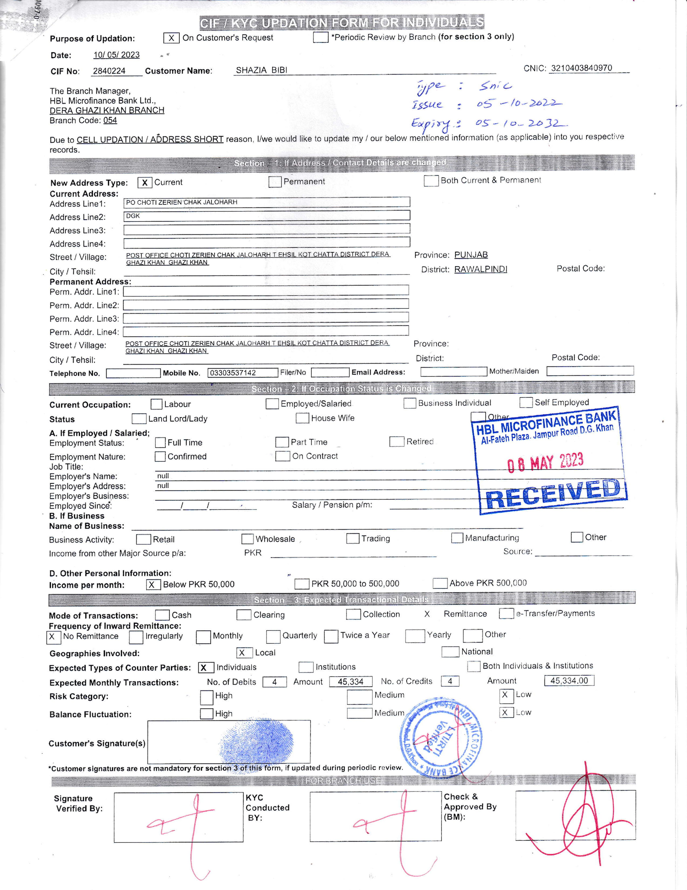

# CIF/KYC UPDATION FORM FOR INDIVIDUALS

> *Purpose of Updation:* ☑ On Customer's Request  
> ☐ *Periodic Review by Branch (for section 3 only)*

---

**Date:** 10/05/2023  
**CIF No:** 2840224  
**Customer Name:** SHAZIA BIBI  
**CNIC:** 3210403840970  

---

**The Branch Manager,**  
HBL Microfinance Bank Ltd.,  
DERA GHAZI KHAN BRANCH  
**Branch Code:** 054  

---

Due to **CELL UPDATION / ADDRESS SHORT** reason, I/we would like to update my / our below mentioned information (as applicable) into your respective records.

---

## 🖼️ Scanned Form Image (Centered at Top)

<div style="text-align: center; margin: 2rem 0;">
  
</div>

---

## 🧠 OCR Results Comparison (Grid of 3 per Row)

<div style="display: grid; grid-template-columns: repeat(auto-fit, minmax(300px, 1fr)); gap: 1.5rem; margin: 2rem 0;">

  <!-- OCR Model 1 -->
  <div style="border: 1px solid #ccc; padding: 1rem; border-radius: 8px; background: #f9f9f9;">
    <h3 style="margin-top: 0; color: #2c3e50;">📌 Tesseract OCR</h3>
    <pre style="background: #fff; padding: 0.75rem; border-radius: 4px; font-family: monospace; overflow-x: auto; white-space: pre-wrap; word-break: break-all;">
Date: 10/05/2023
CIF No: 2840224
Customer Name: SHAZIA BIBI
CNIC: 3210403840970
...
    </pre>
  </div>

  <!-- OCR Model 2 -->
  <div style="border: 1px solid #ccc; padding: 1rem; border-radius: 8px; background: #f9f9f9;">
    <h3 style="margin-top: 0; color: #2c3e50;">📌 Google Vision OCR</h3>
    <pre style="background: #fff; padding: 0.75rem; border-radius: 4px; font-family: monospace; overflow-x: auto; white-space: pre-wrap; word-break: break-all;">
Date: 10/05/2023
CIF No: 2840224
Customer Name: SHAZIA BIBI
CNIC: 3210403840970
...
    </pre>
  </div>

  <!-- OCR Model 3 -->
  <div style="border: 1px solid #ccc; padding: 1rem; border-radius: 8px; background: #f9f9f9;">
    <h3 style="margin-top: 0; color: #2c3e50;">📌 Amazon Textract</h3>
    <pre style="background: #fff; padding: 0.75rem; border-radius: 4px; font-family: monospace; overflow-x: auto; white-space: pre-wrap; word-break: break-all;">
Date: 10/05/2023
CIF No: 2840224
Customer Name: SHAZIA BIBI
CNIC: 3210403840970
...
    </pre>
  </div>

</div>

---

> 💡 *Note: Replace the `...` inside each `<pre>` block with actual OCR output from your chosen models. You can paste full text or key fields.*

---

## 📝 How to Add Real OCR Results

You’ll need to run your scanned image (`KYC_form.jpg`) through:

1. **Tesseract OCR** → https://github.com/madmaze/pytesseract  
2. **Google Vision API** → https://cloud.google.com/vision  
3. **Amazon Textract** → https://aws.amazon.com/textract/

Then copy-paste the extracted text into each `<pre>` block.

Example for Tesseract:

```text
Date: 10/05/2023
CIF No: 2840224
Customer Name: SHAZIA BIBI
CNIC: 3210403840970
Purpose of Updation: On Customer's Request
...
